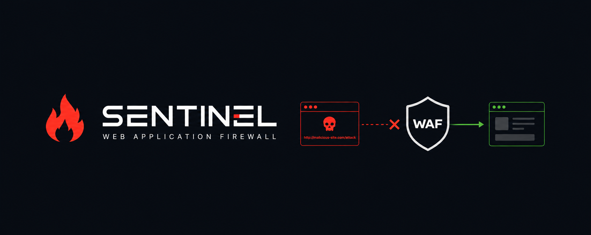

<div align="center">

<br>
# 🔥 SentinelWAF

SentinelWAF is a high performance, terminal driven Web Application Firewall built to detect and mitigate common web based threats in real time.<br>
It combines a Go reverse proxy security engine with a centralized command line controller for rule management, traffic protection, rate limiting, monitoring, configuration, and audit visibility within a streamlined single service architecture.
</div>

## Architecture

```text
Client
  |
  v
SentinelWAF :8080
  |
  v
Backend :9000
```

## Requirements

- Python 3.10+
- Go 1.23+
- macOS or Linux recommended

No Python packages are required.

## Core commands

```bash
python3 controller.py start
python3 controller.py stop
python3 controller.py restart
python3 controller.py status
python3 controller.py status --watch
python3 controller.py enable
python3 controller.py disable
python3 controller.py reset
python3 controller.py validate
```

`start` is idempotent: if SentinelWAF is already healthy it reports the existing process instead of starting another copy.

The controller also detects a port occupied by another application and reports that conflict instead of returning a misleading start failure.

## Security events and metrics

```bash
python3 controller.py events
python3 controller.py events --blocked
python3 controller.py events --limit 100
python3 controller.py stats
python3 controller.py logs --lines 100
python3 controller.py logs --follow
```

Statistics include:

- total requests
- allowed requests
- blocked requests
- block ratio
- top blocked rules
- top attacking IPs
- top targeted paths

The event log is JSON Lines so it remains easy to process with other tools.

## Rule management

List the built-in and custom rules:

```bash
python3 controller.py rules list
```

Enable or disable a rule:

```bash
python3 controller.py rules disable sqli-core
python3 controller.py rules enable sqli-core
```

Add a custom blocking rule:

```bash
python3 controller.py rules add \
  --id block-sensitive-endpoint \
  --name "sensitive endpoint probe" \
  --category "Custom" \
  --severity high \
  --targets path,query \
  --pattern '(?i)^/private(?:/|$)'
```

Remove a custom rule:

```bash
python3 controller.py rules remove block-sensitive-endpoint
```

Configuration changes are written atomically. Restart the WAF after changing rules so the running Go process reloads them.

## IP, path, and user-agent control

Allowlist examples:

```bash
python3 controller.py ip allow list ip
python3 controller.py ip allow add ip 192.168.1.50
python3 controller.py ip allow remove ip 192.168.1.50
```

Blocklist examples:

```bash
python3 controller.py ip block list ip
python3 controller.py ip block add ip 203.0.113.25
python3 controller.py ip block add path /admin
python3 controller.py ip block add ua scanner-name
python3 controller.py ip block remove ip 203.0.113.25
```

IP entries support individual addresses and CIDR ranges through the underlying WAF configuration.

## Configuration management

Show the full configuration:

```bash
python3 controller.py config show
```

Read one setting:

```bash
python3 controller.py config get waf.target_url
```

Update a setting:

```bash
python3 controller.py config set waf.target_url http://127.0.0.1:9000
python3 controller.py config set waf.rate_limit_requests 120
python3 controller.py config set waf.csrf_protection_enabled true
```

The main configuration file is:

```text
config/config.json
```

Important settings include the WAF listen address, backend target, request limits, rate limiting, CSRF protection, allowlists, blocklists, security headers, and custom rules.

## WAF protections

The current engine includes detection for:

- SQL injection
- XSS
- command injection
- path traversal
- local/remote file inclusion indicators
- malformed payload/header sequences
- suspicious scanner user-agents
- IP blocklists
- path blocklists
- request rate limiting
- header validation
- request body size limits
- optional CSRF protection
- configurable security response headers

## Notes

The default WAF address is `127.0.0.1:8080` and the default backend target is `http://127.0.0.1:9000`.

If port 8080 is already in use, SentinelWAF will report the conflict. Change `waf.listen_address` to another local port and restart.

The terminal controller is intentionally the only management interface. It replaces the previous desktop GUI and removes the need for unrelated runtime services.